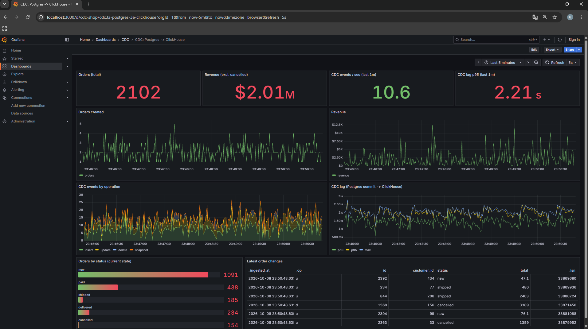
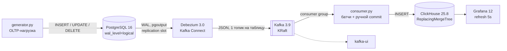

# CDC: PostgreSQL → Debezium → Kafka → ClickHouse

Потоковая репликация изменений (Change Data Capture) из OLTP-базы в аналитическое хранилище в реальном времени. Генератор эмулирует работу интернет-магазина в PostgreSQL, Debezium читает WAL и публикует изменения в Kafka, Python-consumer пишет их батчами в ClickHouse, а Grafana показывает данные и задержку пайплайна вживую.



## Архитектура



| Компонент | Роль | Порт |
|---|---|---|
| PostgreSQL 16 | Источник (OLTP), logical decoding через `pgoutput` | 5432 |
| Kafka 3.9 (KRaft) | Транспорт событий, без ZooKeeper | 29092 (с хоста) |
| Debezium 3.0 (Kafka Connect) | Снапшот + стриминг WAL в Kafka | 8083 |
| consumer.py | Kafka → ClickHouse, батчинг, at-least-once | — |
| ClickHouse 25.8 | Аналитическое хранилище | 8123, 9000 |
| Grafana 12 | Дашборд в реальном времени | 3000 |
| kafka-ui | Просмотр топиков и коннекторов | 8080 |

## Что демонстрирует проект

- **CDC на основе WAL**, а не polling по `updated_at`: ловятся все операции, включая `DELETE`, без нагрузки на таблицы-источники.
- **Начальный снапшот + стриминг**: существующие данные (`op = r`) и последующие изменения приходят единым потоком.
- **Семантику доставки at-least-once с идемпотентным приёмником**: offset коммитится только после успешной вставки, повторы схлопываются в ClickHouse по LSN.
- **Корректную обработку UPDATE и DELETE** в append-only хранилище через `ReplacingMergeTree(version, is_deleted)`.
- **Измеримость**: end-to-end лаг от коммита в Postgres до записи в ClickHouse, автоматическая сверка источника и приёмника, сценарии отказов.

## Структура проекта

```
.
├── docker-compose.yml          # весь стенд
├── reset.ps1                   # полный сброс стенда + регистрация коннектора
├── connectors/
│   └── postgres-shop.json      # конфигурация Debezium-коннектора
├── postgres/
│   └── init.sql                # схема магазина + стартовые товары
├── clickhouse/
│   └── init.sql                # целевые таблицы
├── grafana/
│   ├── provisioning/           # datasource и провайдер дашбордов
│   └── dashboards/cdc-shop.json
├── generator.py                # генератор OLTP-нагрузки
├── consumer/
│   └── consumer.py             # Kafka → ClickHouse
├── verify.py                   # сверка Postgres и ClickHouse
└── requirements.txt
```

## Быстрый старт

Требования: Docker Desktop, Python 3.11+.

```powershell
# 1. Поднять стенд и зарегистрировать коннектор
.\reset.ps1

# 2. Python-окружение
python -m venv .venv
.\.venv\Scripts\Activate.ps1
pip install -r requirements.txt

# 3. Окно 1: нагрузка
python generator.py --rps 5

# 4. Окно 2: consumer
python .\consumer\consumer.py

# 5. Остановить генератор и сверить источник с приёмником
python verify.py
```

На Linux/macOS вместо `reset.ps1` выполните `docker compose up -d --wait` и зарегистрируйте коннектор:
`curl -X POST -H "Content-Type: application/json" --data @connectors/postgres-shop.json localhost:8083/connectors`.

| UI | Адрес |
|---|---|
| Grafana | http://localhost:3000 (дашборд **CDC → CDC: Postgres -> ClickHouse**) |
| kafka-ui | http://localhost:8080 |
| Debezium REST | http://localhost:8083/connectors/shop-connector/status |

## Как это устроено

### Источник: PostgreSQL

Схема магазина: `customers`, `products`, `orders`, `order_items`. Для CDC включено:

- `wal_level=logical`, `max_replication_slots`, `max_wal_senders`: без них logical decoding недоступен;
- `REPLICA IDENTITY FULL` на всех таблицах: в событиях UPDATE/DELETE приходит полная старая версия строки, а не только первичный ключ.

Генератор (`generator.py`) выполняет взвешенные случайные действия, каждое в своей транзакции: создание заказа с позициями, переходы статусов `new → paid → shipped → delivered | cancelled`, изменение цен, переезд клиентов и удаление отменённых заказов (с каскадным удалением позиций). Так в потоке присутствуют все три типа операций.

### Захват изменений: Debezium

Ключевые параметры коннектора (`connectors/postgres-shop.json`):

| Параметр | Значение | Зачем |
|---|---|---|
| `plugin.name` | `pgoutput` | встроенный плагин logical decoding, ничего не нужно ставить |
| `snapshot.mode` | `initial` | при первом запуске выгрузить текущее содержимое таблиц |
| `decimal.handling.mode` | `string` | `NUMERIC` без потери точности (по умолчанию приходит base64) |
| `value.converter.schemas.enable` | `false` | не тащить схему в каждое сообщение |
| `transforms.unwrap` | `ExtractNewRecordState` | плоская строка вместо конверта `before/after` |
| `add.fields` | `op,lsn,source.ts_ms` | тип операции, версия и время коммита в каждом сообщении |
| `delete.tombstone.handling.mode` | `rewrite` | DELETE приходит обычной записью с `__deleted = "true"` |

Пример события в топике `shop.public.orders`:

```json
{
  "id": 106, "customer_id": 73, "status": "paid", "total": "1529.97",
  "created_at": "2026-10-05T08:33:39.947123Z", "updated_at": "2026-10-05T08:33:52.011540Z",
  "__deleted": "false", "__op": "u", "__lsn": 27463816, "__source_ts_ms": 1791189232011
}
```

### Доставка: consumer

`consumer/consumer.py` читает четыре топика одной consumer group и пишет в ClickHouse:

- **Батчинг**: буферы сбрасываются по размеру (1000 строк) или по таймеру (1 с), что наступит раньше.
- **Ручной commit**: `enable.auto.commit=false`, offset коммитится только после успешной вставки всех буферов.
- **Ретраи**: при ошибке вставки 5 попыток с экспоненциальным backoff (2, 4, 8, 16, 32 с), затем падение без коммита. Лучше упасть громко, чем молча потерять данные.
- **Graceful shutdown**: по Ctrl+C дописывается хвост буфера, коммитятся offset'ы, consumer корректно выходит из группы.

### Хранилище: ClickHouse

Каждая таблица — `ReplacingMergeTree(_lsn, _is_deleted) ORDER BY id` со служебными колонками:

| Колонка | Источник | Назначение |
|---|---|---|
| `_op` | `__op` | `c` / `u` / `d` / `r` (снапшот) |
| `_lsn` | `__lsn` | версия строки: LSN монотонно растёт, даже внутри одной транзакции |
| `_source_ts` | `__source_ts_ms` | время коммита в Postgres |
| `_is_deleted` | `__deleted` | удалённые строки отбрасываются при `FINAL` |
| `_ingested_at` | `DEFAULT now64(3)` | время вставки в ClickHouse |

Текущее состояние читается через `FINAL`, а без `FINAL` таблица работает как журнал изменений (например, для графика CDC-событий по операциям). Повторно доставленные сообщения имеют тот же `_lsn`, поэтому схлопываются: так получается идемпотентность без exactly-once.

## Результаты

### Консистентность

`verify.py` сравнивает Postgres и ClickHouse `FINAL` по каждой таблице: количество строк, суммы ключевых полей, распределение заказов по статусам. Скрипт отказывается работать, пока источник меняется, ждёт, пока consumer догонит, и отдельно показывает ещё не схлопнутые дубли.

```
check              status postgres | clickhouse
customers          OK     335, 56615, 320
products           OK     8, 1917.25
orders             OK     998, 613943, 1055909.94
orders_by_status   OK     cancelled=70,delivered=112,new=518,paid=220,shipped=78
order_items        OK     2485, 3782558, 4944, 1055909.94

RESULT: CONSISTENT
```

### Задержка (end-to-end)

Лаг считается как `_ingested_at - _source_ts`, то есть от коммита транзакции в Postgres до записи строки в ClickHouse. Нагрузка 5 действий/с, локальный стенд на Docker Desktop:

| p50 | p95 | p99 |
|---|---|---|
| 1.5 с | 2.3 с | 2.4 с |

Из чего складывается задержка:

| Этап | Вклад |
|---|---|
| Debezium (`poll.interval.ms`, по умолчанию 500 мс) | до ~0.5 с |
| Буфер consumer'а (`FLUSH_INTERVAL_SEC = 1.0`) | до 1 с |
| Kafka, сеть, вставка в ClickHouse | десятки–сотни мс |

Лаг можно уменьшить до ~0.3–0.5 с (`poll.interval.ms=100`, `FLUSH_INTERVAL_SEC=0.2`) ценой в 5 раз более частых мелких вставок в ClickHouse. Это классический компромисс между латентностью и размером батча; для аналитики секундная задержка обычно приемлема.

### Отказоустойчивость

Каждый сценарий выполнялся под нагрузкой, после чего генератор останавливался и запускался `verify.py`. Чтобы дубли можно было увидеть до фонового мержа, на время теста мержи останавливались (`verify.py --stop-merges` / `--start-merges`).

| Сценарий | Как ломали | Результат | Дубли | Что показывает |
|---|---|---|---|---|
| Consumer упал между вставкой и commit | `consumer.py --crash-after-flush N` | CONSISTENT | 15 строк (1 батч) | at-least-once: батч доставлен повторно и схлопнут по `_lsn` |
| ClickHouse недоступен ~15 с | `docker stop clickhouse` | CONSISTENT | — | ретраи с backoff; пока вставка не прошла, offset не коммитится |
| Debezium убит | `docker kill connect` | CONSISTENT | — | replication slot держал WAL (`active = f`, 416 kB), после рестарта чтение продолжилось с сохранённого LSN |

## Ограничения и что учесть в продакшене

- **Replication slot удерживает WAL**, пока коннектор не подтвердит чтение. Если Debezium долго лежит, WAL растёт и может заполнить диск Postgres. Нужен алерт на `pg_replication_slots` и/или `max_slot_wal_keep_size`.
- **Повторы есть на двух уровнях**: Debezium после жёсткого падения переотправляет события с последнего сброса offset'ов (раз в 60 с), consumer — последний незакоммиченный батч. Корректность держится на идемпотентности приёмника, поэтому запросы к текущему состоянию должны использовать `FINAL` (или `argMax` по `_lsn`).
- **Эволюция схемы** не автоматизирована: новую колонку в Postgres нужно вручную добавить в ClickHouse и в маппинг consumer'а.
- **Одна партиция на топик**: порядок событий по ключу гарантирован, но масштабирование consumer'а ограничено. Для роста — больше партиций с ключом по первичному ключу (Debezium так и делает).
- **Нет DLQ**: битые сообщения логируются и пропускаются.
- **Локальный стенд**: один брокер, replication factor 1, анонимный admin-доступ в Grafana, пароли в открытом виде в `docker-compose.yml`.

## Что можно развить

- Schema Registry + Avro вместо JSON, автоматическая эволюция схемы.
- Dead letter queue для непарсящихся сообщений.
- Альтернативный путь доставки через ClickHouse Kafka Engine + Materialized View и сравнение с Python-consumer'ом.
- Метрики consumer'а (lag consumer group, размер батча, ошибки) в Prometheus.
- Денормализованная витрина `orders` + `order_items` + `products` в ClickHouse через Materialized View.
